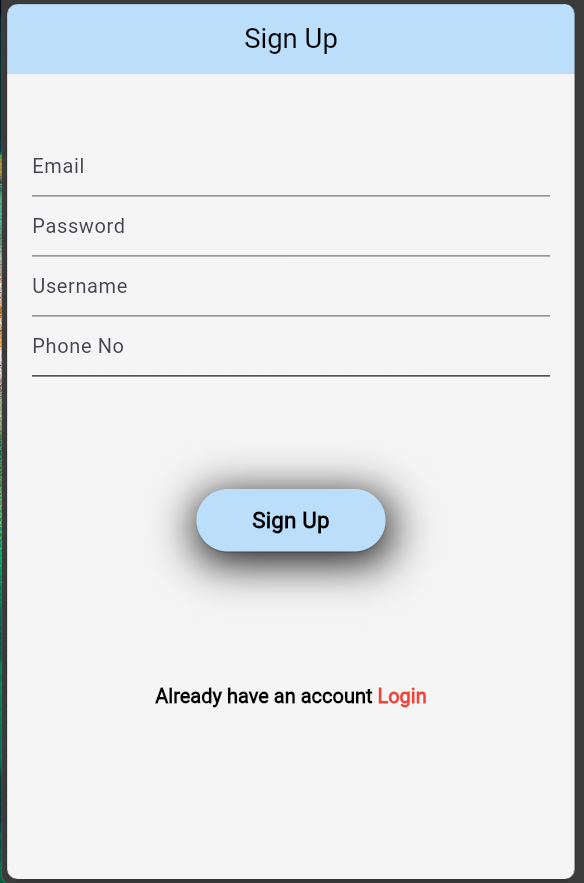
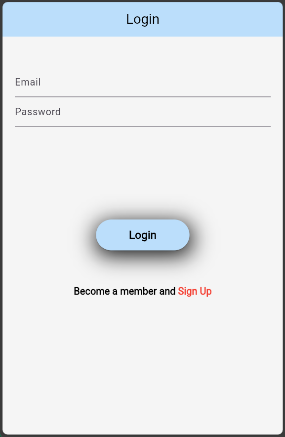
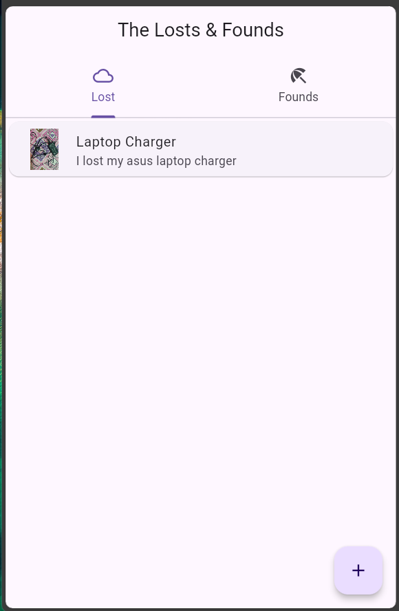
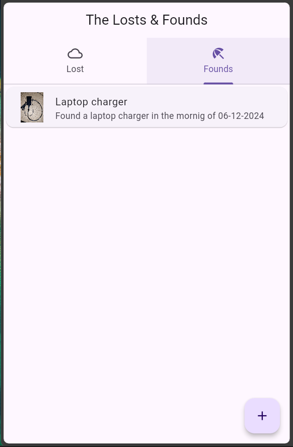
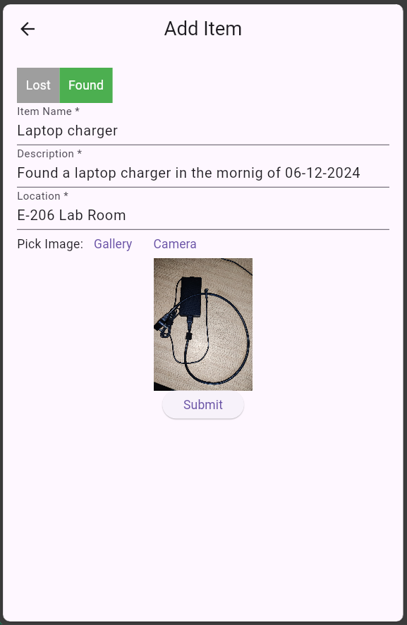

# Lost and Found

A Flutter-based cross-platform application to help users report, search, and manage lost and found items. This project is developed using **Flutter SDK 3.5.4** and supports Android, iOS, Web, Windows, macOS, and Linux.

## Features
- Report a lost item with details and images.
- Search for found items with categories and filters.
- Add items to the lost and found database.
- User authentication system.
- View item details with contact information.
- Multi-platform support.

## Table of Contents
- [Installation](#installation)
- [Usage](#usage)
- [Screenshots](#screenshots)
- [Project Structure](#project-structure)

## Installation

### Prerequisites
- Flutter SDK (version 3.5.4): [Install Flutter](https://flutter.dev/docs/get-started/install)
- Git: [Install Git](https://git-scm.com/book/en/v2/Getting-Started-Installing-Git)
- IDE/Text Editor (e.g., VS Code, Android Studio)

### Steps to Setup
1. Clone the repository:
   ```bash
   git clone https://github.com/AshishBytes/lost_and_found.git
   cd lost_and_found
   ```

2. Install dependencies:
   ```bash
   flutter pub get
   ```

3. Run the app:
   ```bash
   flutter run
   ```

4. To build for a specific platform, use:
   - **Android**: `flutter build apk`
   - **iOS**: `flutter build ios`
   - **Web**: `flutter build web`
   - **Windows**: `flutter build windows`
   - **macOS**: `flutter build macos`
   - **Linux**: `flutter build linux`

## Screenshots

### Signup Page


### Login Page


### Lost Items Screen


### Found Items Screen


### Add Lost and Found Screen


## Project Structure

```plaintext
lib/
├── main.dart                # Entry point
├── data/                    # Contains data services, APIs, and mock data
│   ├── api_service.dart     # API service files for fetching data
│   └── data_provider.dart   # Data provider classes
├── model/                   # Contains data models
│   ├── item.dart            # Data model for items
│   └── user.dart            # Data model for user
├── screens/                 # Screens for the app
│   ├── home_screen.dart     # Home screen of the app
│   ├── lost_item_screen.dart # Screen for reporting lost items
│   ├── found_item_screen.dart # Screen for searching found items
│   ├── login_screen.dart    # Screen for user login
│   ├── signup_screen.dart   # Screen for user signup
│   └── add_lost_and_found_screen.dart # Add lost and found items screen
assets/
├── images/                  # Image assets
│   ├── signup_page.png      # Screenshot for signup page
│   ├── login_page.png       # Screenshot for login page
│   ├── report_lost_item.png # Screenshot for report lost item page
│   ├── search_found_items.png # Screenshot for search found items page
│   └── add_lost_and_found_screen.png # Screenshot for add lost and found items page
└── fonts/                   # Font files
    └── custom_font.ttf      # Custom font for the app
```

## Usage
1. Open the app on your device/emulator.
2. Register/login to access features.
3. Use the navigation to report or search for items.
